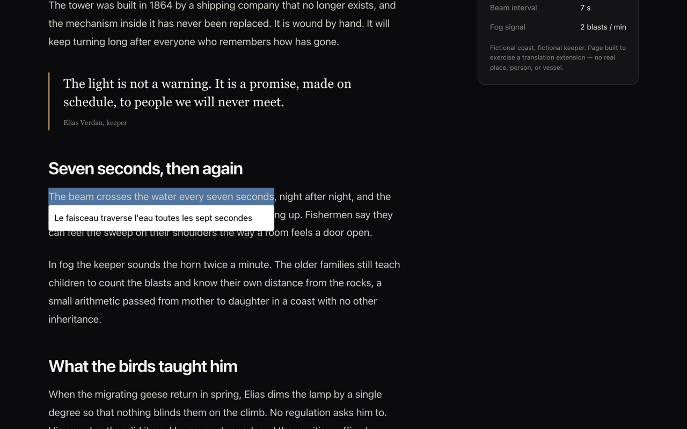
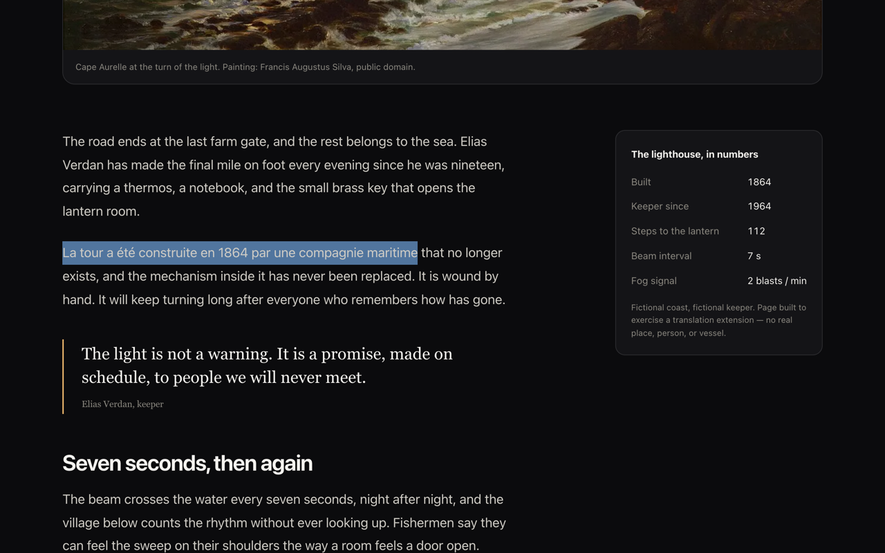
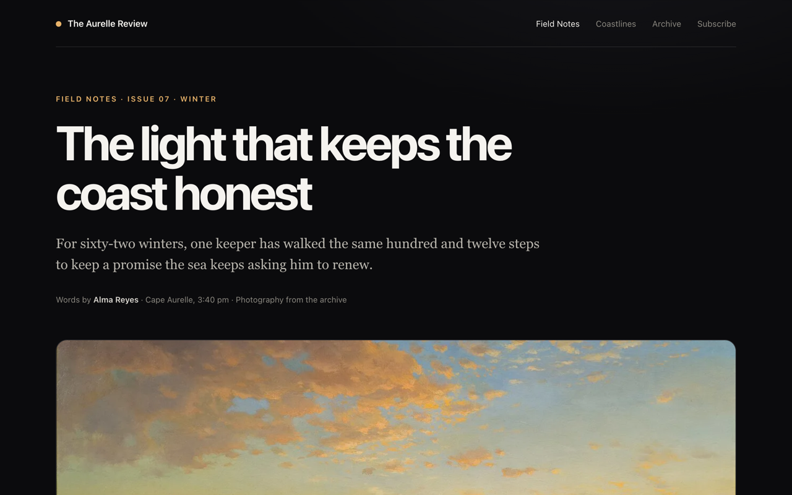
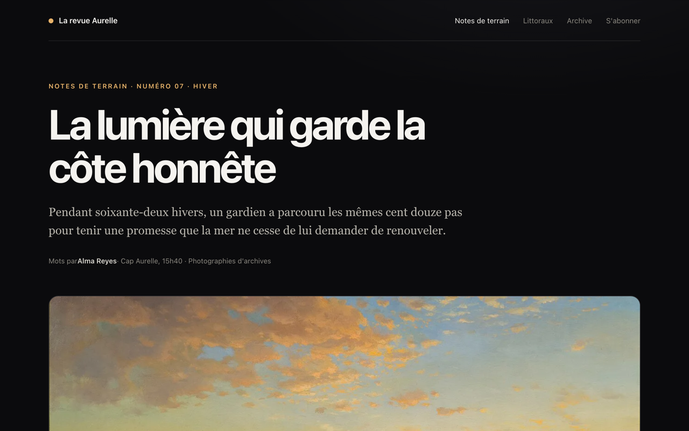

# PK Traduction

[🇫🇷 FR](README.md) · [🇬🇧 EN](README_en.md)

Traduction instantanée de texte avec affichage en popup ou substitution directe. Made by PK-Labs.

**Landing :** [store/index.html](store/index.html) — **v2026.10.4**

## ✅ Fonctionnalités
- Traduction instantanée du texte sélectionné.
- Mode de substitution directe du texte.
- Traduction de page entière par lots.
- Indicateur de chargement en temps réel.
- Interface épurée et positionnement automatique.
- Menu de l'icône : langue cible (🇫🇷 🇬🇧 🇪🇸 🇩🇪 🇮🇹) et mode de traduction.

## 🧠 Utilisation
- **Traduction popup :** Sélectionnez du texte sur une page web, le popup s'affiche automatiquement en dessous.
- **Substitution directe :** Activez l'option dans les paramètres, le texte sélectionné sera remplacé.
- **Traduction de page :** Cliquez sur l'icône de l'extension pour traduire tout le contenu de la page active.

## 📸 Captures

| | |
|---|---|
|  |  |
| *Popup sous la sélection* | *Substitution directe* |
|  |  |
| *Page entière — avant* | *Page entière — après (traduite)* |

Captures réelles de l'extension sur un article fictif, générées via `store/media-kit/` (voir son [README](store/media-kit/README.md)).

## ⚙️ Réglages
- Langue cible (défaut : français).
- Mode de traduction automatique.
- Option de substitution directe.

## 🧾 Commandes
- Clic gauche sur l'icône : déclenche la traduction de page.
- Sélection de texte : déclenche la traduction rapide.

## 📦 Build & Package
- Les fichiers sources sont situés dans `/src`.
- Les assets et la landing sont situés dans `/store`.
- Un build compressé est disponible dans `/release`.

## 🧪 Installation
1. Téléchargez ou clonez ce dépôt.
2. Ouvrez `chrome://extensions/` dans Chrome.
3. Activez le **Mode développeur**.
4. Cliquez sur **Charger l'extension non empaquetée** et sélectionnez le dossier `/src`.

> 📌 La fiche Chrome Web Store est en cours de publication ; le lien officiel remplacera cette note.

## ☕ Soutien

PK Traduction est gratuite et open source. Si elle vous est utile, un café aide à la faire vivre : **[Soutenir sur Ko-fi](https://ko-fi.com/pouark)** ☕❤️

## 🧾 Changelog

Voir [CHANGELOG.md](CHANGELOG.md) (source de vérité).

## 🔗 Liens
- **Landing :** [store/index.html](store/index.html)
- **Politique de confidentialité :** [store/privacy-policy-pktraduction.html](store/privacy-policy-pktraduction.html)
- **Site :** [mondary.design](https://mondary.design)
- **Description store :** [store/description-store.md](store/description-store.md)
- **Ko-fi :** [ko-fi.com/pouark](https://ko-fi.com/pouark)
- EN README : [README_en.md](README_en.md)
